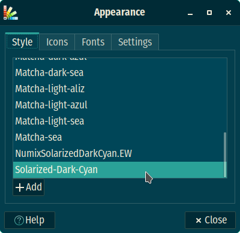

## My setup for AwesomeWM & XFCE

Basically, what I customized to my liking into:

- `~/.config/awesome/rc.lua` file
- `~/.themes`
- `~/.icons/`

XFCE specific settings can easily be accessed using `modkey` (Win key by default) + `p` and type _settings manager_ to get it. Or directly type _appearance_ to use it for setting the theme and icons.

### Theme (Appearance)

Using `Solarized-Dark-Cyan` theme, taken from [Solarized-Dark-COLORPACK [Versions also added for GS-3.36]](https://www.xfce-look.org/p/1308808/).



Firefox theme used is [Oceanic Blue](https://addons.mozilla.org/en-US/firefox/addon/oceanic-blue-jdgregson/).

### Icons

Using `Material-Black-Pistachio-Suru` icon theme (taken from [
material-black COLORS Icon-Superpack](https://www.xfce-look.org/p/1333360/)) to be placed into `~/.icons/` directory.

### Colors

Using `#2BD4C0` and `#022630` as terminal (lxterminal or terminator) foreground and background respectively.

### Alt-Tab

Used [this](https://github.com/sagb/alttab) nice tool for the standard alt+tab functionality, but in order to behave properly, I had to delay its execution at startup by using this script:

```shell
❯ cat /home/dxps/apps/scripts/run_alttab.sh
#!/bin/sh

sleep 3
alttab -bg "#002B36" -font xft:FiraSansCondensed -theme "Material-Black-Pistachio-Suru" -i 400x40 -t 400x140 -p none

❯
```

and have it run as part of awesomewm session startup using:

```shell
❯ tail -n3 ~/.config/awesome/autorun.sh
run /home/dxps/apps/scripts/run_alttab.sh

❯
```
